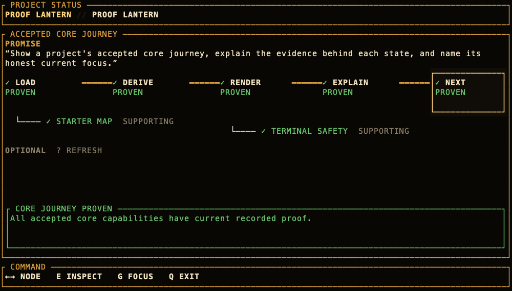

# Proof Lantern

[](https://github.com/stoicpickle/prooflantern/actions/workflows/ci.yml)

Proof Lantern is an experimental, local-first terminal tool that shows what a
project has decided to build, what appears to exist, what has actually been
proven, and what still breaks the core user journey. It then names one honest
current focus and explains what evidence would move the project forward.



## Start here

You need [Rust](https://www.rust-lang.org/tools/install) 1.88 or newer and a
terminal at least 100 columns by 30 rows.

To try the built-in Recipe Box example without creating any files:

```sh
git clone https://github.com/stoicpickle/prooflantern.git
cd prooflantern
cargo run -- demo
```

To install the `proof-lantern` command from this checkout:

```sh
cargo install --locked --path .
proof-lantern demo
```

You can also install it without keeping a clone:

```sh
cargo install --locked --git https://github.com/stoicpickle/prooflantern.git
```

The demo is synthetic and is always labeled that way. It is designed to show
the visual language before you make a map for your own project.

## Map your own project

After installing the command above, open the folder containing your own project
and run:

```sh
proof-lantern init .
```

This creates one commented file at `.proof-lantern/project.yml`. It never
overwrites an existing map. Open the file and replace its promise and three
starter capabilities with the shortest journey your user needs to complete,
then run:

```sh
proof-lantern .
```

New capabilities begin as `UNKNOWN`. That does not mean they are broken. It
means you have recorded your intention but have not yet recorded technical
evidence. Start with roughly three to five core capabilities; Proof Lantern is
most useful when the map stays focused on the central experience.

See [Writing a project map](docs/PROJECT_FORMAT.md) for copyable evidence,
supporting-capability, and optional-capability examples.

## Read the map

| State | Meaning |
| --- | --- |
| `✓ PROVEN` | Current recorded proof says the capability works. |
| `◐ BUILT / UNPROVEN` | Implementation appears to exist, but no passing proof is current. |
| `╳ MISSING` | Explicit current evidence says required implementation is absent. |
| `! PROOF FAILED` | A current recorded check failed. |
| `? UNKNOWN` | No current technical evidence establishes whether it exists or works. |
| `⚠ CONFLICTING` | Current evidence disagrees, so Proof Lantern refuses to guess. |

Missing evidence produces `UNKNOWN`, never `MISSING`. Code existing is not the
same as behavior being proven.

Inside the TUI:

- `←` / `→` or `h` / `l`: select a capability
- `e` or `Enter`: open or close the compact inspector
- `g`: return to the current focus
- `q` or `Ctrl-C`: exit and restore the terminal

Plain terminal commands expose the same evaluated model:

```sh
proof-lantern next .
proof-lantern explain capability-id .
```

At 128×36 and above, the inspector remains visible beside the journey.

## Evidence boundary

Proof Lantern deliberately separates authority:

- `.proof-lantern/project.yml` is human-owned. It contains the promise,
  accepted capabilities, journey order, proof requirements, notes, and manual
  evidence.
- `.proof-lantern/observations.json` is replaceable machine evidence. Static
  scans may establish only that implementation appears present. Imported test
  results may record passing or failing verification.
- Display states and the current focus are derived. They are never stored as
  editable progress labels.

Current file evidence must resolve inside the project root and cite real,
readable lines. Stale historical evidence remains visible without counting as
current proof. Proof Lantern validates whether a citation can be inspected; it
cannot decide whether the cited text truly proves its summary.

## Prototype scope

This public preview proves that a small accepted journey can be rendered,
inspected, and prioritized without turning source files into fake progress. It
also exercises real `q`, Ctrl-C, error, and panic terminal restoration paths.

It does not yet generate journeys, scan repositories, refresh evidence, execute
project code, or edit intent inside the TUI. Core capabilities are rendered as
one ordered line; dependency-shaped journey visualization remains future work.

## Development

```sh
cargo fmt --check
cargo clippy --all-targets --all-features -- -D warnings
cargo test --all-targets --all-features
git diff --check
```

Rendered proof is generated through the same Ratatui `TestBackend` used by the
snapshot tests. See [proof/README.md](proof/README.md) for the commands.

The original product kickoff remains in
[`BUILD_MAP_CODEX_KICKOFF.md`](BUILD_MAP_CODEX_KICKOFF.md); “build map” is the
generic visualization, while Proof Lantern is the product name.

Contributions are welcome; start with [CONTRIBUTING.md](CONTRIBUTING.md).

## License

Proof Lantern is available under either the [MIT License](LICENSE-MIT) or the
[Apache License 2.0](LICENSE-APACHE), at your option.
